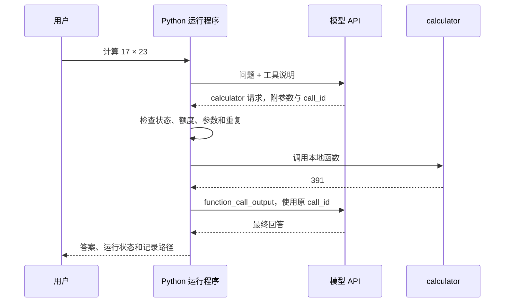

# Python Agent 第一周详细教程：从 API 到可追踪的工具调用循环

编写日期：2026-09-17。依据《Python_Agent_计划审阅与日级路线》中第 1 周的 D01–D07 编写。

适合已经熟悉 Python、测试和部署，希望理解 Agent 运行原理的学习者。每天按约 60 分钟安排：10 分钟读原理、35 分钟做实验、10 分钟验收、5 分钟记录。完整参考代码已经提供，不要求每天从头抄完；先运行，再阅读当天涉及的函数，最后亲手做一个小改动。

本周完成一个命令行计算助手。它能请求固定的 calculator 工具，由本地 Python 验证并执行，再将结果交给模型生成回答；遇到非法参数、循环重复、额度不足或超时，会留下明确的停止原因。

**验证范围：配套项目已做离线测试；没有使用你的密钥，没有发起付费请求。真实 API 接入代码依据 OpenAI 官方文档编写，仍需你在 D01 和 D04 完成实际集成验收。模拟通过不能证明模型接入成功。**

交付验证：Python 3.14.6 下，21 项自动测试及 10 项命令行检查通过。命令行检查包含 9 类模拟运行和“预算未配置时禁止真实调用”；明细保存在代码目录的 `验证结果.json`。Python 3.11 是代码使用的最低语言版本要求，未逐一测试所有 Python 小版本。

## 0. 使用方式与本周路线

教程使用 Python 3.11 及以上版本。模拟模式只依赖标准库；真实模式以 OpenAI Responses API 和官方 Python SDK 为具体例子。服务商是教学示例选择，并不表示你已经选定了它。若改用其他服务商，需要重新实现模型适配层并核对其工具调用协议，不要只替换地址就假定兼容。

| 学习日 | 核心问题 | 本日产物 |
|---|---|---|
| D01 | 如何可靠地区分请求、响应与用量？ | 首次调用记录、配置示例、环境版本 |
| D02 | 普通文本、结构化输出和工具请求有什么不同？ | 同题三次实验，两种输出形式对照 |
| D03 | 工具输入不合法时，谁负责拒绝？ | 有明确契约的四则运算工具 |
| D04 | 谁执行 Python，如何把结果关联回请求？ | 一次工具调用的完整链路 |
| D05 | Agent 为什么会停下来？ | 步数、时间、调用额度、费用和重复限制 |
| D06 | 怎样证明失败没有被记成成功？ | 运行日志、8 个核心用例及边界测试 |
| D07 | 能否不用代码解释运行机制？ | 成功/失败演示、本周复盘和版本快照 |

### 0.1 文件布局

教程与代码位于同一父目录：

```text
股票分析/
├── Python_Agent_计划审阅与日级路线.md
├── Python_Agent_第一周详细教程.md        ← 本文，文末包含完整源码
└── Python_Agent_第一周代码/
    ├── README.md
    ├── calculator.py                  ← 工具描述、解析、校验和执行
    ├── model.py                       ← 模拟模型和 OpenAI 适配器
    ├── runtime.py                     ← 循环、停止条件、记录
    ├── main.py                        ← 命令行、实验配置和版本清单
    ├── test_week1.py                  ← 8 个核心测试及补充检查
    ├── config.example.json            ← 不包含密钥的预算示例
    ├── requirements.txt               ← 真实模式的 SDK 依赖
    ├── logs/                          ← 运行后生成，一次运行一个 JSONL
    └── artifacts/                     ← 运行后生成，实验配置及结果清单
```

下面的命令均在代码目录运行。先进入目录：

```bash
cd '/Users/wy/SynologyDrive/文档/笔记/股票分析/Python_Agent_第一周代码'
python3 --version
```

若输出低于 Python 3.11，换用已经安装的较新 Python 解释器。不要为了本教程替换系统 Python。

### 0.2 五分钟确认项目可运行

```bash
python3 main.py probe
python3 main.py run
python3 -m unittest -v test_week1
```

第二条命令的关键结果应是：

```json
{
  "mode": "mock",
  "status": "completed",
  "stop_reason": "final_answer",
  "answer": "391",
  "model_calls": 2,
  "tool_calls": 1,
  "estimated_usd": 0.0
}
```

这是节选，不包含每次会变化的 `run_id`、耗时和日志路径。模拟用量也是人为构造的数字；费用为 0 表示没有付费请求，不表示真实模型免费。

**MockModel 是预先写好的响应脚本，不理解问题。** 即使把问题改成其他乘法，默认模拟场景仍然返回 17 × 23。它用来验证程序的动作顺序和失败处理；验证模型能力必须使用真实模式。

## 1. 先理解三个角色

| 角色 | 职责 | 本周对应代码 |
|---|---|---|
| 模型 | 根据上下文输出文字或工具请求 | `model.py` |
| 运行程序（Runtime） | 决定是否继续、是否允许执行、如何记录 | `runtime.py` |
| 工具 | 接受确定参数并执行确定功能 | `calculator.py` |

本周最重要的链路：



如果编辑器不显示 Mermaid，可以按这六步理解：用户提问 → 模型提出动作 → 程序检查 → Python 执行 → 回传工具结果 → 模型回答。

工具调用协议负责描述请求及其结果关联；本地函数的执行由你的程序承担。[官方工具调用文档](https://developers.openai.com/api/docs/guides/function-calling)   [平替DS的文档](https://api-docs.deepseek.com/zh-cn/guides/tool_calls/)

## 2. D01：跑通最小调用，保留配置与用量

### 今天要回答的问题

“我看到一段模型回答时，能否同时说明它来自哪个模型、请求是否完成、消耗了多少 token，以及有没有真的发送 API 请求？”

### 2.1 创建独立环境

```bash
python3 -m venv .venv
source .venv/bin/activate
python --version
python main.py probe
```

此时不需要安装任何第三方包，也不需要密钥。`probe` 禁用工具，只执行一次模型调用。先确认模拟模式会输出状态和日志路径。

准备做真实接入时，再安装官方 SDK：

```bash
python -m pip install -r requirements.txt
python -m pip freeze > requirements.lock.txt
python -c 'import openai; print(openai.__version__)'
```

`requirements.txt` 提供安装范围；`requirements.lock.txt` 记录你这次实际装到的全部版本。教程不将“允许安装”表述为“范围内每个版本都验证通过”。首次接通后，后续复现实验使用锁定文件。

### 2.2 把模型名称、密钥与代码分开

先在服务商账户中确认你能使用的模型，并核对它支持 Responses API、函数工具和结构化输出。这里不固定一个可能失效的模型名称。

在 macOS 默认 zsh 终端执行：

```zsh
read 'OPENAI_MODEL?请输入已确认可用的模型 ID：'
export OPENAI_MODEL
read -s 'OPENAI_API_KEY?请输入 API Key（输入不显示）：'
export OPENAI_API_KEY
print
```

这段命令适用于 zsh；不要把真实密钥直接写进命令、Python 文件、Markdown 或预算 JSON。SDK 从环境变量读取密钥。本项目不自动读取 `.env`；仅创建 `.env` 而不加载不会生效。

模型适配器的核心初始化如下，完整实现见附录 B：

```python
from openai import AsyncOpenAI

# 密钥由 SDK 从 OPENAI_API_KEY 读取。
# 禁用隐式重试，让一次运行记录对应明确的请求次数。
client = AsyncOpenAI(max_retries=0, timeout=30.0)
```

第一次使用优先选择你已拥有访问权限、费用明确的文本模型。若使用推理模型，`max_output_tokens` 需要容纳其推理与可见输出；不足可能得到 `incomplete`。本项目默认 1024，遇到截断时先记录，再有预算地调大，不能只看打印出了几行字就记成功。[Responses API 参数与状态](https://developers.openai.com/api/reference/python/resources/responses/methods/create)

### 2.3 配置预算

```bash
cp -n config.example.json config.local.json
```

在编辑器中填写 `config.local.json`。示例的金额全部为 0，表示“尚未确认”；程序会拒绝真实模式，避免把教程里的虚构金额当作你的预算。

| 字段 | 含义 |
|---|---|
| `month_budget_usd` | 月预算 M |
| `month_remaining_usd` | 本月实际剩余额度，运行前手动核对 |
| `run_budget_usd` | 单次运行预算 B，包括这一轮中的所有模型调用 |
| `eval_budget_usd` | 评测预算 E，是月预算中的一部分，不是额外赠送额度 |
| `eval_remaining_usd` | 评测剩余额度，做对照实验前核对 |
| `call_reserve_usd` | 每次 API 请求前预留的保守金额 |
| `input_usd_per_million` | 选定模型每百万输入 token 的单价 |
| `output_usd_per_million` | 选定模型每百万输出 token 的单价 |
| `price_checked_on` | 核价日期，例如 `2026-09-17` |
| `price_source` | 实际核价的官方页面 |

金额统一用美元，与填写的单价保持一致。单价从当日官方价格页核对，不把其他模型、Batch 或特殊服务层的价格填进来。[官方价格页](https://developers.openai.com/api/docs/pricing)

费用估算采用：

```text
估算费用 = (input_tokens × 输入单价 + output_tokens × 输出单价) / 1,000,000
```

这是本教程的文本调用简化口径。它没有精确处理缓存折扣、特殊服务层、额外计费项目和税费，不能替代平台账单。`output_tokens` 已按 API 的输出用量字段计入；不要另将 reasoning token 再加一次。

每次请求前扣住一份 `call_reserve_usd`，本次运行内不释放。举例：**纯算术示例，不是推荐预算或模型报价**，若单次预算 B 为 0.05、每次预留 0.02，则最多允许两次请求；第三次会被挡住，即使前两次的估算费用更低。

本周预留金额由你手动估算，因此只是本地控制策略：低估时，某个已发出的请求仍可能超过预留金额，代码会检测并停止后续调用。**它不是服务商侧的硬费用上限。** 保守预留应考虑历史累计输入、工具定义、最大输出及相应计费项目；无法判断时先使用模拟模式。

月额度和评测额度只在本次命令开始时检查，没有跨进程账本：每次真实运行后手动更新余额，不要并发运行多个真实实验。生产阶段再实现持久化预留与对账。账户中如有消费限制，应另行核对其实际行为。

### 2.4 首次真实调用

完成账户、模型与预算配置后：

```bash
python main.py probe --real
```

`--real` 是真实调用的显式开关。默认执行 `probe`、`compare`、`run` 都是模拟模式，不会因为环境里存在密钥而自动收费。

打开输出的 `*-manifest.json`，确认：

1. `mode` 为 `real`，而不是 `mock`。
2. 记录了 Python、SDK 版本和源文件摘要。
3. 日志 `model_response` 记录了 API 实际返回的模型名及 `response_id`。
4. `api_status` 为 `completed`；运行结果为 `completed / final_answer`。
5. 有 `input_tokens`、`output_tokens`，并且 `usage_complete` 为 `true`。

`OPENAI_MODEL` 可以是会变化的模型别名；实际响应里的模型标识也要保存。若账户支持固定快照且你需要重复实验，优先使用可访问的固定快照。固定快照也不意味着输出一定相同。

### 2.5 验收与常见错误

| 现象 | 检查与处理 |
|---|---|
| `ModuleNotFoundError` | 检查当前解释器是否为刚创建的虚拟环境，以及 SDK 是否安装在其中 |
| 缺预算、密钥或模型 ID | 补配置；不要先删掉检查条件 |
| `AuthenticationError` | 检查账户和密钥，不把密钥贴进学习日志 |
| `NotFoundError` / 模型相关错误 | 核对账户能访问的模型 ID，不凭名称猜测权限 |
| `RateLimitError` | 查看平台额度、速率限制和计费状态；本周程序不自动重试 |
| `time_limit` | 运行已停止；该请求是否在服务端计费仍可能未知，先对账 |
| `usage_unknown` | 用量未知，程序不再追加调用，不能把未知记为 0 |

程序只记录模型异常的类别，不输出原始异常正文或请求头。如果需要进一步诊断，在本地检查服务商控制台，不启用会把凭据写进日志的调试输出。

**D01 验收：** 保存一次运行清单、SDK 版本、模型标识和预算参数；能够解释真实/模拟标记。若尚未有预算或账户，就写“D01 模拟已通过，真实调用待补验”，而不是写“API 已接通”。

## 3. D02：比较消息角色、普通回答和结构化输出

### 今天要回答的问题

“模型输出一个 JSON 对象，是否意味着它已经执行了工具？”答案是否定的。普通 JSON 是回答的表示形式；工具请求是运行协议里的动作请求。

### 3.1 看懂请求中的消息

运行程序构造以下历史：

```python
history = [
    {"role": "system", "content": SYSTEM},
    {"role": "developer", "content": DEVELOPER},
    {"role": "user", "content": question},
]
```

| 消息/项目 | 本周含义 | 示例 |
|---|---|---|
| `system` | 服务整体约束 | 教学助手，不能假装执行动作 |
| `developer` | 应用开发者规定的行为 | 有计算工具时，数值计算请求工具 |
| `user` | 当前任务 | 计算 17 × 23 |
| `assistant` | 模型输出的消息 | 最终解释文本 |
| `function_call` | 模型返回的工具请求项目 | calculator + 参数 + call_id |
| `function_call_output` | 程序提交的工具结果项目 | 与原 call_id 对应的执行结果 |

最后两项不是随便起名的聊天角色；它们是 Responses API 的项目类型。不要混用其他 API 的 `tool` 角色或消息结构。

资料中的文字也不应该自动变成 `system` 或 `developer` 指令。你之后加入“读取文档”能力时，应把读取内容当作任务材料；材料里写着“忽略约束”并不能扩大 Python 的执行权限。

### 3.2 普通回答与结构化回答

普通回答可能是：

```text
17 × 23 = 391。
```

结构化回答可以是：

```json
{"answer": 391, "explanation": "17 与 23 相乘得到 391。"}
```

本项目使用 `text.format` 中的 JSON Schema 约束结构，关键定义如下：

```python
ANSWER_FORMAT = {
    "type": "json_schema",
    "name": "calculation_answer",
    "strict": True,
    "schema": {
        "type": "object",
        "properties": {
            "answer": {"type": "number"},
            "explanation": {"type": "string"},
        },
        "required": ["answer", "explanation"],
        "additionalProperties": False,
    },
}
```

随后在 API 请求中设置 `text={"format": ANSWER_FORMAT}`。这比只在提示词里要求“请输出 JSON”更明确，但满足结构不等于事实正确；拒绝与未完成的响应需要单独处理。[官方结构化输出文档](https://developers.openai.com/api/docs/guides/structured-outputs)

### 3.3 同题三次对照实验

先用模拟模式熟悉产物：

```bash
python main.py compare
```

该命令执行六次独立运行：普通文本三次、结构化输出三次，问题相同，每次重新创建历史。模拟响应完全相同是预期行为，不能拿来研究模型随机性。

预算确认后，真实实验执行：

```bash
python main.py compare --real
```

这会产生最多六个付费请求。开始前程序检查整批预留是否小于填写的月剩余额度及评测剩余额度；任何一轮失败都会中断后续批次，并保留已完成记录。剩余轮次要在查明原因和核对余额后重新安排，不自动补跑。

填写对照表，每个结果都保留，失败也要填：

| 形式 | 轮次 | API 状态/停止原因 | 答案是否为 391 | 结构有效？ | 输入/输出 token | 估算费用 |
|---|---|---|---|---|---|---|
| 普通 | 1 | 待填写 | 待填写 | 不适用 | 待填写 | 待填写 |
| 普通 | 2 | 待填写 | 待填写 | 不适用 | 待填写 | 待填写 |
| 普通 | 3 | 待填写 | 待填写 | 不适用 | 待填写 | 待填写 |
| 结构化 | 1 | 待填写 | 待填写 | 待填写 | 待填写 | 待填写 |
| 结构化 | 2 | 待填写 | 待填写 | 待填写 | 待填写 | 待填写 |
| 结构化 | 3 | 待填写 | 待填写 | 待填写 | 待填写 | 待填写 |

观察措辞、答案、字段类型、用量和耗时。三次相同只能说明这三次相同；三次不同也不能仅凭差异推断质量差。不要把一个小样本包装成稳定性结论。

### 3.4 角色实验与失败实验

用一次真实调用改变应用约束，同时保留同一个问题：

```bash
python main.py probe --real --developer '只输出最后的数值，不写解释。'
```

把结果与原 `probe` 比较；此实验额外消耗一次请求，预算不足就留到 D07。模拟脚本不响应这条提示词变化，因此不能代替该实验。

拒绝与截断可以离线注入，避免为制造失败而付费：

```bash
python main.py run --scenario refusal
python main.py run --scenario incomplete
```

预期均为 `status=failed`，原因分别为 `refusal` 和 `response_incomplete`。命令退出码为 1 是本次故障实验的正确结果。`completed` 的接口响应里也可能含拒绝内容，所以程序额外检查 refusal，不能仅依赖 API 的状态字符串。

**D02 验收：** 能解释“可解析 JSON”“符合 Schema”“事实正确”“执行过工具”这四件不同的事；对照表不遗漏失败，截断或拒绝不算完成。

## 4. D03：实现明确契约的 calculator

### 今天要回答的问题

“如果模型给了错误参数，程序能否不猜测、不执行其他动作，而是返回确定错误？”

### 4.1 定义输入、输出和执行范围

工具只接收三个字段：

```json
{"operation": "multiply", "a": 17, "b": 23}
```

输入规则是本地程序的规则：

- 操作符只允许 `add`、`subtract`、`multiply`、`divide`。
- `a`、`b` 必须是真正的数值，不接受 `"17"` 或 `true`。
- 数值必须有限，且绝对值不超过 10^12；除数不能为 0。
- 不接受额外字段、重复 JSON 键、NaN、Infinity 或超过 2048 字节的参数。
- 工具名称固定为 `calculator`，未知工具名直接拒绝。

成功和失败都使用相同的外层形状：

```json
{"ok": true, "value": 391, "error": null}
```

```json
{"ok": false, "value": null, "error": {"code": "DIVISION_BY_ZERO", "message": "除数不能为零"}}
```

`ok` 用于程序判断，错误代码用于测试与统计，说明文字方便人和模型理解。不要用“返回了一段字符串”来区分成功与失败。

### 4.2 本地执行的核心代码

```python
OPS = {
    "add": operator.add,
    "subtract": operator.sub,
    "multiply": operator.mul,
    "divide": operator.truediv,
}

# 输入先通过本地校验，才允许执行这一行。
value = OPS[operation](a, b)
```

工具不接收 `"17 * 23"` 这样的任意表达式，也不使用 `eval()`。把有限操作映射到固定函数，执行能力就能从代码里直接看清。它没有网络访问、文件写入或任意 Python 执行能力。

完整 `calculator.py` 见附录 A。今天按顺序阅读 `calculator()` → `parse_arguments()` → `execute()`，再阅读给模型看的 `TOOL`。这样容易分清“本地执行边界”和“模型看到的接口说明”。

### 4.3 亲自运行四组输入

```bash
python - <<'PY'
from calculator import calculator

cases = [
    {"operation": "multiply", "a": 17, "b": 23},
    {"operation": "power", "a": 2, "b": 3},
    {"operation": "add", "a": "2", "b": 3},
    {"operation": "divide", "a": 8, "b": 0},
]
for case in cases:
    print(case, '->', calculator(case))
PY
```

预期依次得到：391、`INVALID_OPERATION`、`INVALID_TYPE`、`DIVISION_BY_ZERO`。再把字符串 `"2"` 改成 `True`；仍应是 `INVALID_TYPE`。这是因为 Python 的 `bool` 是 `int` 的子类，示例用 `type(value)` 做精确类型检查。

可以追加一个未知工具实验：

```bash
python - <<'PY'
from calculator import execute
print(execute('shell', '{"command":"anything"}'))
PY
```

结果必须是 `UNKNOWN_TOOL`；不会启动 shell。

### 4.4 今天的小改动

将输入绝对值上限从 10^12 改成 10^6，增加一个 10^7 的测试输入，观察它从成功变成 `OUT_OF_RANGE`。再恢复原上限，确保全套测试能通过。

这个实验要回答的是：权限和边界由代码决定。JSON Schema 的 `strict` 有助于参数生成，但不能替代本地校验；测试注入、手工调用或将来更换服务商，仍然可能产生不合法参数。

本工具使用 Python 原生整数/浮点数做教学计算；它不是处理货币精度的财务计算模块。未来如要处理金额，应另定义 Decimal、精度和舍入规则。

**D03 验收：** 正常、非法操作符、参数类型错误都有确定结果；能够指出代码中真正执行运算的位置。

## 5. D04：接通工具请求与结果回传

### 今天要回答的问题

“模型返回 `calculator` 后，究竟发生了什么？第二次模型调用怎么知道工具结果属于哪一次请求？”

### 5.1 阅读一个工具请求

第一次响应的 `output` 中可能出现：

```json
{
  "type": "function_call",
  "call_id": "call_1",
  "name": "calculator",
  "arguments": "{\"operation\":\"multiply\",\"a\":17,\"b\":23}"
}
```

这里 `arguments` 是一个 JSON **字符串**，因此先解析、再校验。`call_id` 是关联标识，不是 Python 函数名称，也不是整次运行的编号。

| 标识 | 层级 | 用途 |
|---|---|---|
| `run_id` | 你的程序的一次任务 | 串联整个任务的事件 |
| `response_id` | 一次 API 响应 | 查找某次模型响应 |
| `call_id` | 某个工具请求 | 将工具结果与模型的请求对应 |

不同层级的 ID 不应相互替代。真实服务返回的字符串不需要像示例一样简短。

### 5.2 程序执行并回传

以下是完整运行程序中的关键链路，省略了周围的停止检查：

```python
history.extend(reply.output)
result = execute(name, raw)
history.append({
    "type": "function_call_output",
    "call_id": call_id,
    "output": json.dumps(result, ensure_ascii=False, allow_nan=False),
})
# 下一轮将 history 再交给 model.respond(...)。
```

需要同时保存模型返回的完整 `output`，以及新增的工具结果。对于有推理状态项目的模型，不能只留下工具名与参数。示例使用 `store=False`，并请求 `reasoning.encrypted_content` 以便在后续输入中回放不透明状态；这不代表获取模型隐藏推理正文。也不要将这些不透明内容写入学习日志。[Responses API 的 include 与 store 参数](https://developers.openai.com/api/reference/python/resources/responses/methods/create)

示例没有混用 `previous_response_id`，而是显式传回本地维护的历史。第一周只理解这一种方式即可。

### 5.3 演示一个完整成功任务

```bash
python main.py run --max-calls 2
```

预期 2 次模型调用、1 次工具调用、最终答案 391。观察该任务的 JSONL 日志，事件顺序应为：

```text
run_start
model_start
model_response
tool_request
tool_result
model_start
model_response
run_end
```

检查 `tool_request.call_id == tool_result.call_id`，并检查 `tool_result.result.value == 391`。这比只看最终答案有更直接的证据：模型即使能自行算出 391，也不代表它真的请求过工具。

然后进行一次真实补验：

```bash
python main.py run --real --max-calls 2
```

预期链路与模拟相同，但真实模型不保证遵守工具使用要求。如果它直接回答了 391：运行协议可能正常完成，但 **D04 的工具调用验收未通过**。记录 `tool_calls=0`，检查提示词、模型能力和请求里的工具定义，再安排有预算的补验，不能只因答案正确就打勾。

### 5.4 做一个能证明执行位置的实验

```bash
python - <<'PY'
import asyncio
from calculator import calculator
from model import MockModel
from runtime import run

def visible_calculator(args):
    print('本地 Python 已进入工具函数：', args)
    return calculator(args)

result = asyncio.run(run(MockModel(), '计算 17 × 23', handler=visible_calculator))
print(result['status'], result['answer'])
PY
```

终端中“本地 Python 已进入工具函数”的输出来自你写的函数。`MockModel` 只提供工具请求；真正运行乘法的是宿主进程。

也可以在 `calculator()` 的运算行打断点。暂停后不会出现工具结果回传；继续运行才会进入第二次模型调用。

本周为便于理解，设置 `parallel_tool_calls=False`，并在本地拒绝一次响应中的多个工具请求。工具错误发生时记录错误并立即停止，不自动重试或让模型修改参数。成功路径会将结果回传；错误路径保留结果记录，但不会再发请求。后续扩展错误恢复时再改变这项策略。

**D04 验收：** 能从请求找到执行结果和同一个 call_id；能用断点或本地输出证明 Python 是由运行程序执行的。

## 6. D05：将一次调用扩展成有边界的循环

### 今天要回答的问题

“如果模型持续要求执行同一个计算，程序会在何时、以什么原因停下来？”

### 6.1 循环的骨架

```python
while True:
    # 1. 检查时间、步数、调用数、上下文大小和费用预留。
    # 2. 请求一次模型响应。
    # 3. 检查用量、拒绝、未完成与异常。
    # 4. 若是有效最终回答，返回结果。
    # 5. 若是工具请求，检查关联 ID 与重复，执行固定工具。
    # 6. 把请求与结果放回历史，进入下一轮。
    ...
```

此段用于解释控制流；实际可运行代码在附录 C。不要把省略号骨架替换进项目。

`Limits` 把程序决定的边界集中在一个地方。默认值是教学用的可调整参数，不是行业标准。

| 参数 | 默认值 | 限制内容 |
|---|---:|---|
| `max_steps` | 6 | 决策轮数 |
| `max_calls` | 4 | 实际发起的模型请求次数，失败请求也计数 |
| `max_seconds` | 30 | 整次运行的时间预算 |
| `repeat_limit` | 2 | 连续出现已见动作的允许阈值 |
| `max_history_bytes` | 24000 | 序列化历史的字节上限 |
| `max_output_tokens` | 1024 | 每次响应的最大输出 token |
| `run_budget_usd` | 0 | 真实运行预算，未配置则不允许调用 |
| `call_reserve_usd` | 0 | 真实请求前的单次费用预留 |

本周每步恰好调用一次模型，没有重试，因而步数和模型调用数通常相等。两者仍分别记录，是为了理解未来“一步内有限重试”时为什么不能只限制步数。

历史字节限制是防止示例无限膨胀的本地措施，不是精确的 token 计算，更不是模型上下文窗口的完整预算。

### 6.2 实验一：限制调用次数

```bash
python main.py run --max-calls 1
```

预期：已经执行了乘法，但没有额度做第二次模型请求，返回 `stopped / call_limit`。不能因为工具算出 391 就伪造一个“模型最终回答已完成”的状态。

将上限改成 2：

```bash
python main.py run --max-calls 2
```

预期 `completed / final_answer`。这说明完成一个带工具的任务往往需要不止一次模型请求。

### 6.3 实验二：限制决策轮数

```bash
python main.py run --max-steps 1 --max-calls 4
```

预期 `stopped / step_limit`。当多个条件同时满足时，程序按照代码检查顺序返回第一个原因。本项目顺序是时间 → 步数 → 调用数 → 上下文 → 费用预留，随后才发请求。

### 6.4 实验三：制造没有进展的重复

```bash
python main.py run --scenario repeat
```

模拟模型会不断提出相同参数，但使用不同 `call_id`。当前阈值为 2，预期：

| 响应 | 动作是否已见过 | 连续重复计数 | 程序行为 |
|---|---|---:|---|
| 第 1 次 | 否 | 0 | 执行工具 |
| 第 2 次 | 是 | 1 | 执行工具 |
| 第 3 次 | 是 | 2 | 记录 `tool_blocked` 并停止 |

最终 `model_calls=3`、`tool_calls=2`、`stop_reason=no_progress`。比较的是“工具名 + 规范化后的参数”，不是 call_id，也不是原始 JSON 的空格和字段顺序。

这是一种针对无副作用计算工具的简单启发式，不理解真正的任务进展。一个 Agent 不断换新参数可以绕过重复检测，但仍会被步数、调用数和时间限制停止。未来处理允许重复读取的任务时，要重新设计“进展”的含义。

今天亲手把 `repeat_limit` 从 2 改为 1，观察第二次响应就被阻止，然后恢复原值并重跑对应测试。

### 6.5 实验四：验证总时长

```bash
python -m unittest -v test_week1.CoreEight.test_08_time_limit
```

测试用一个响应很慢的模拟模型配合很短的时间额度。`asyncio.wait_for()` 限制等待剩余时间，并返回 `time_limit`，而不是把超时算成完成。

运行程序的时钟使用 `time.monotonic()`；它适合计算经过时长，不受系统时间校准的直接影响。

这里的“总时长”是本地循环与模型等待的限制。固定 calculator 很快，但它仍是同步函数；如果你把它替换成一个卡死的同步函数，这个示例不能强行中断它。不能把当前超时写法当作任意代码的硬超时或安全沙箱。网络请求在客户端停止等待后，服务端也可能仍在处理或产生费用，需要核对账单。

### 6.6 实验五：验证调用前的费用门槛

```bash
python -m unittest -v test_week1.BoundaryChecks.test_money_reservation_before_request
```

测试把本地假模型标成真实计费模式，设置“单次运行剩余额度小于一次预留”。预期 `budget_limit`，并且请求次数为 0。这里仍是离线假对象，不会联网。

关键原则是先检查并预留，再发请求。不能先调用十次，结束时才发现超过预算。预算预留不会消除真实计费的不确定性，因此未知用量和估算超过预留都需要停止。

**D05 验收：** 能分别演示 `call_limit`、`step_limit`、`no_progress`、`time_limit`、`budget_limit`，并能解释每项实际约束的范围。

## 7. D06：运行记录与 8 个小用例

### 今天要回答的问题

“出现失败时，能否定位到模型、参数、工具或停止策略，而不靠猜测？”

### 7.1 读一份 JSONL 日志

JSONL 是一行一个 JSON 对象。一次运行共用一个 `run_id`，多个工具请求分别带 `call_id`。

下面是经过删减的模拟日志示意，耗时是示意值，不是性能测试数据：

```json
{"run_id":"demo","event":"tool_request","call_id":"call_1","name":"calculator","arguments":"{\"operation\":\"multiply\",\"a\":17,\"b\":23}"}
{"run_id":"demo","event":"tool_result","call_id":"call_1","tool_status":"ok","result":{"ok":true,"value":391,"error":null},"tool_elapsed_ms":0.1}
{"run_id":"demo","event":"run_end","status":"completed","stop_reason":"final_answer","model_calls":2,"tool_calls":1}
```

重点字段：

| 字段 | 用途 |
|---|---|
| `mode` | 区分真实实验和模拟实验 |
| `api_status` | 服务端返回的本次响应状态 |
| `status` / `stop_reason` | 本地任务状态和实际终止原因 |
| `model_calls` / `tool_calls` | 分别统计模型请求与进入工具执行器的次数 |
| `tool_status` / `error.code` | 区分工具成功、非法参数与内部异常 |
| `elapsed_ms` / `tool_elapsed_ms` | 整体经过时长与单次工具耗时 |
| `input_tokens` / `output_tokens` | 已知响应的累计用量 |
| `usage_complete` | 是否知道所有已发请求的用量 |
| `estimated_usd` | 按填写单价计算的估算；有未知请求时为 null |
| `reserved_usd` | 已占用的预留金额，不等同于实际账单 |

这里的 `tool_calls` 包含进入执行器后被参数校验拒绝的尝试；是否真正成功运算，要看 `tool_status` 与 `result.ok`。被无进展策略提前阻止的请求不计入执行器调用数。

日志保存计算参数、工具结果和最终答案；运行清单还保存练习题和开发者提示词，因此只使用无敏感数据的题目。密钥不写入清单，程序也不导出整个环境变量。实际资料在今后的章节中需要另设计日志保留与脱敏规则。

本周日志先在内存收集，结束时写入磁盘，便于理解；强制杀进程或机器断电可能没有完整日志。不能据此宣称具备崩溃恢复或持久化执行能力，这属于后续状态章节。

### 7.2 把协议完成与任务正确分开

本地状态有三类：

- `completed`：收到允许的最终文本，协议正常收尾。
- `failed`：明确遇到拒绝、截断、非法参数、工具异常等失败。
- `stopped`：因为时间、额度、重复或取消等条件停止。

`completed` 不自动意味着题目答对了。例如答案写成 392，仍可能满足文本协议；独立验收应将该任务判为不合格。D04 还要求真的执行工具，所以直接给对数字也不足以通过工具链验收。

### 7.3 八个核心用例

| 编号 | 场景 | 独立判据 |
|---|---|---|
| 01 | 直接回答 | 完成；工具次数为 0；得到预期文本 |
| 02 | 正常计算 | 391；2 次模型请求；1 次工具执行；call_id 对应 |
| 03 | 非法操作符 | `INVALID_OPERATION`；任务失败 |
| 04 | 参数类型错误 | 字符串与布尔值被拒绝；任务失败 |
| 05 | 工具内部异常 | `TOOL_ERROR`；不泄漏内部异常内容 |
| 06 | 重复动作 | 第 3 次响应触发 `no_progress`；只执行 2 次工具 |
| 07 | 模型调用额度耗尽 | `call_limit`；没有第 2 次模型请求 |
| 08 | 时间额度耗尽 | `time_limit`；不执行工具；费用未知不记为 0 |

运行核心集合：

```bash
python -m unittest -v test_week1.CoreEight
```

运行全部检查：

```bash
python -m unittest -v test_week1
```

当前配套版本共有 21 项测试方法；包含结构化输出、重复 call_id、上下文限制、取消、费用预留与 OpenAI 适配器请求形状等补充检查。部分方法内部包含多个子场景。

这些测试通过的含义是“程序按预期处理了注入的响应”。它们不证明真实模型总会调用正确工具，也不证明供应商接受所有请求参数。OpenAI 适配器测试使用假客户端，不依赖 SDK 安装或网络。

### 7.4 为什么不依赖模型主动犯错来测试

你很难要求一个真实模型每次都生成非法 JSON，也不应该为了等它进入无限循环而持续付费。模拟对象可以精确提供失败输入，让测试关注执行器的确定行为。

工具崩溃的注入方式：

```python
def broken_tool(args):
    raise RuntimeError("模拟内部故障")

result = await run(MockModel(), "计算", handler=broken_tool, log_dir=None)
# 断言 result["status"] == "failed"
```

这是测试函数中的片段。顶层脚本调用异步函数要使用 `asyncio.run()`，不要直接把顶层 `await` 粘贴到普通 Python 文件里运行。

### 7.5 今日的小改动与记录

增加一个自己选择的确定性边界用例，例如 `execute()` 收到额外字段或大小刚超过限制。写清楚输入、预期错误代码、实际结果，而不是只断言“没有抛异常”。

将失败分类记录成下面的表：

| 输入 | 层级 | 预期 | 实际 | 判定 |
|---|---|---|---|---|
| operation=power | 参数校验 | INVALID_OPERATION | 待填写 | 待填写 |
| 工具内部异常 | 工具执行 | TOOL_ERROR | 待填写 | 待填写 |
| 相同动作重复 | Runtime 策略 | no_progress | 待填写 | 待填写 |
| API 用量缺失 | 模型接口 | usage_unknown | 待填写 | 待填写 |

**D06 验收：** 核心 8 项测试通过；能从日志还原一条完整链路；故障实验的非完成状态没有被改写成成功。

## 8. D07：复盘、补验与保存版本

今天不增加新功能。优先补 D01 的真实调用、D04 的真实工具链，或前六天尚未完成的失败实验。如果账户和预算仍未准备好，保留“真实集成待补验”即可，不以模拟结果替代。

### 8.1 六十分钟安排

| 时间 | 动作 |
|---|---|
| 0–10 分钟 | 不看代码，画用户 → Runtime → 模型 → 工具 → 回传 → 回答 |
| 10–25 分钟 | 演示一个成功任务和一个重复停止任务 |
| 25–40 分钟 | 重跑核心测试，补最重要的一项缺口 |
| 40–50 分钟 | 核对版本、日志、预算和真实/模拟标记 |
| 50–60 分钟 | 写复盘，保存当前版本，明确第二周起点 |

演示命令：

```bash
python main.py run
python main.py run --scenario repeat
python main.py run --scenario bad-arguments
python -m unittest -v test_week1.CoreEight
```

第二、第三条返回非零退出码是预期结果，不要把它们放入要求所有命令必须成功的命令链中。

### 8.2 不看代码回答七个问题

1. 模型返回 function_call 时，计算发生了吗？
2. JSON Schema 和本地参数检查分别解决什么？
3. run_id、response_id、call_id 有什么区别？
4. 为什么一次正常计算需要两次模型请求？
5. 输出了正确数字但没有工具记录，是否通过 D04？
6. 请求超时后，能否直接将费用记为 0？
7. 为什么工具执行失败、程序停止和事实答错不能混为一类？

参考要点：尚未执行；生成约束与执行校验；任务/响应/工具关联；先请求工具再依据结果回答；未通过；不能；它们位于不同层级，需要不同修复方式。

### 8.3 保存可复现版本

如果你已有 Git 工作流，在独立的练习仓库中提交这些源文件、无密钥配置示例和学习记录，并创建本周标签即可。不要为完成教程在整个笔记目录里自动初始化仓库，也不要把本地配置、真实日志或密钥提交进去。

没有使用 Git，也可以从代码目录生成一个只包含教学文件的压缩包：

```bash
python - <<'PY'
from datetime import datetime
from pathlib import Path
from zipfile import ZipFile, ZIP_DEFLATED

name = 'week1-source-' + datetime.now().strftime('%Y%m%d-%H%M%S') + '.zip'
files = ['README.md', 'calculator.py', 'model.py', 'runtime.py', 'main.py',
         'test_week1.py', 'config.example.json', 'requirements.txt', '.gitignore']
if Path('requirements.lock.txt').exists():
    files.append('requirements.lock.txt')
with ZipFile(name, 'x', compression=ZIP_DEFLATED) as archive:
    for filename in files:
        archive.write(filename)
print(name)
PY
```

运行清单已经保存了源码 SHA-256，可用来识别实验时的代码版本。源码摘要只能帮助追踪版本，不证明运行结果正确。

### 8.4 本周复盘模板

复制到自己的学习记录中填写：

```text
学习周 / 日期：
Python 版本 / SDK 版本：
服务商 / 请求模型 ID / 响应模型 ID：
使用模式：真实 / 模拟 / 两者都有
预算 M / B / E / 单次预留：
本周已知估算费用 / 待核对请求：

我能独立解释的调用链：
成功案例 run_id / 日志路径：
失败案例 run_id / 停止原因：
核心用例通过数 / 总数：
真实 API 补验结果：
真实工具链补验结果（工具次数与实际结果）：

本周最重要的一个错误：
我如何定位并验证修复：
仍不能证明的事情：
第二周第一件事：
```

## 9. 本周验收清单与当前边界

- [ ] D01：有配置示例、版本、模型标识和用量记录；密钥与代码分离。
- [ ] D02：同题三次的真实实验已完成，或明确标记待补验；拒绝、截断不记成功。
- [ ] D03：正常计算、非法操作符、错误类型有确定结果，没有任意表达式执行。
- [ ] D04：从 call_id 对应到实际结果；真实工具链已验收或标明待补。
- [ ] D05：能演示至少五类停止原因，能说明费用预留和时间限制的边界。
- [ ] D06：核心 8 个测试通过，有可读日志和失败分类。
- [ ] D07：能脱离代码解释链路，保存本周版本与复盘。

当前程序是教学版本。它只有固定计算工具，没有文档读取、网页搜索、长期记忆、任意代码执行或无人值守能力。费用余额需人工维护，日志在结束时落盘，答案正确性仍需独立验收。第二周再按计划加入工具注册与文件读取/写入，不必在第一周增加这些模块。

## 10. 官方阅读与接口核对

每次只读与当天问题有关的小节，阅读控制在约 10 分钟。接口资料于编写时查阅，后续使用仍应以账户支持和官方当前说明为准。

| 资料 | 阅读任务 |
|---|---|
| [Function calling](https://developers.openai.com/api/docs/guides/function-calling) | D03–D04：工具定义、call_id、结果回传 |
| [Structured model outputs](https://developers.openai.com/api/docs/guides/structured-outputs) | D02：输出结构、拒绝与未完成 |
| [Create a model response](https://developers.openai.com/api/reference/python/resources/responses/methods/create) | D01、D04：状态、usage、完整响应项目 |
| [Pricing](https://developers.openai.com/api/docs/pricing) | D01：确认选定模型、计费单位及附加条件 |

下面给出完整可复制源码。源文件与附录由同一份内容生成；修改练习代码之后，应以实际 `.py` 文件为准，并保存自己的版本。

<!-- SOURCE_APPENDIX -->

## 附录 A：calculator.py 完整内容

保存位置：`Python_Agent_第一周代码/calculator.py`。

```python
"""D03：只有固定四则运算，不接收或执行任意表达式。"""
import json
import math
import operator

OPS = {"add": operator.add, "subtract": operator.sub,
       "multiply": operator.mul, "divide": operator.truediv}

TOOL = {
    "type": "function", "name": "calculator",
    "description": "对两个有限数值做四则运算；需要计算时使用此工具。",
    "strict": True,
    "parameters": {
        "type": "object",
        "properties": {
            "operation": {"type": "string", "enum": list(OPS)},
            "a": {"type": "number"}, "b": {"type": "number"},
        },
        "required": ["operation", "a", "b"],
        "additionalProperties": False,
    },
}


def error(code, message):
    return {"ok": False, "value": None,
            "error": {"code": code, "message": message}}


def calculator(args):
    if not isinstance(args, dict) or set(args) != {"operation", "a", "b"}:
        return error("INVALID_ARGUMENTS", "必须且只能包含 operation、a、b")
    op, a, b = args["operation"], args["a"], args["b"]
    if not isinstance(op, str) or op not in OPS:
        return error("INVALID_OPERATION", "仅支持 add/subtract/multiply/divide")
    # bool 是 int 的子类，因此不能仅用 isinstance(x, (int, float))。
    for value in (a, b):
        if type(value) not in (int, float):
            return error("INVALID_TYPE", "a、b 必须是数值，不能是字符串或布尔值")
        if abs(value) > 1e12 or not math.isfinite(value):
            return error("OUT_OF_RANGE", "输入必须有限且绝对值不超过 10^12")
    if op == "divide" and b == 0:
        return error("DIVISION_BY_ZERO", "除数不能为零")
    value = OPS[op](a, b)
    return {"ok": True, "value": value, "error": None}


def parse_arguments(raw):
    if not isinstance(raw, str) or len(raw.encode("utf-8")) > 2048:
        raise ValueError("参数不是字符串或超过 2048 字节")

    def reject_constant(value):
        raise ValueError("不允许 NaN/Infinity")

    def unique_object(pairs):
        result = {}
        for key, value in pairs:
            if key in result:
                raise ValueError("JSON 不允许重复键")
            result[key] = value
        return result

    return json.loads(raw, parse_constant=reject_constant,
                      object_pairs_hook=unique_object)


def execute(name, raw, handler=calculator):
    if name != "calculator":
        return error("UNKNOWN_TOOL", "未注册的工具")
    try:
        args = parse_arguments(raw)
    except (ValueError, RecursionError):
        return error("INVALID_JSON", "工具参数不是允许的 JSON")
    try:
        return handler(args)
    except Exception:
        # 不把 traceback、环境变量等内部信息交给模型。
        return error("TOOL_ERROR", "工具内部执行失败")
```

## 附录 B：model.py 完整内容

保存位置：`Python_Agent_第一周代码/model.py`。

```python
"""D01、D02、D04：统一响应形状；模拟模型只用于机制验证。"""
import asyncio
import copy
import json
import os
from dataclasses import dataclass, field

SYSTEM = "你是中文教学助手。简洁回答，不声称执行了没有执行的动作。"
DEVELOPER = "有 calculator 时，数值计算必须请求工具；工具失败时如实说明。"
QUESTION = "请计算 17 乘以 23，并用一句中文解释。"
ANSWER_FORMAT = {
    "type": "json_schema", "name": "calculation_answer", "strict": True,
    "schema": {
        "type": "object",
        "properties": {"answer": {"type": "number"},
                       "explanation": {"type": "string"}},
        "required": ["answer", "explanation"],
        "additionalProperties": False,
    },
}


@dataclass
class Reply:
    status: str = "completed"
    text: str = ""
    output: list = field(default_factory=list)
    usage: dict | None = None
    refusal: bool = False
    response_id: str = "mock-response"
    model: str = "scripted-mock-v1"
    incomplete_reason: str | None = None


def final(text="391"):
    return Reply(text=text, usage={"input_tokens": 40, "output_tokens": 10})


def call(args=None, call_id="call_1", name="calculator"):
    args = args if args is not None else {"operation": "multiply", "a": 17, "b": 23}
    return Reply(output=[{"type": "function_call", "call_id": call_id,
                          "name": name, "arguments": json.dumps(args)}],
                 usage={"input_tokens": 50, "output_tokens": 20})


class MockModel:
    mode = "mock"

    def __init__(self, replies=None, delay=0):
        self.replies = replies or [call(), final()]
        self.delay = delay
        self.inputs = []
        self.index = 0

    async def respond(self, history, tools, text_format, max_output_tokens):
        self.inputs.append(copy.deepcopy(history))
        await asyncio.sleep(self.delay)
        reply = self.replies[min(self.index, len(self.replies) - 1)]
        self.index += 1
        return copy.deepcopy(reply)

    async def close(self):
        pass


class OpenAIModel:
    mode = "real"

    def __init__(self):
        from openai import AsyncOpenAI
        self.model = os.environ.get("OPENAI_MODEL", "")
        if not self.model or not os.environ.get("OPENAI_API_KEY"):
            raise ValueError("真实模式需要 OPENAI_MODEL 与 OPENAI_API_KEY")
        self.client = AsyncOpenAI(max_retries=0, timeout=30.0)

    async def respond(self, history, tools, text_format, max_output_tokens):
        params = dict(model=self.model, input=history, store=False,
                      max_output_tokens=max_output_tokens,
                      include=["reasoning.encrypted_content"])
        if tools:
            params.update(tools=tools, parallel_tool_calls=False)
        if text_format:
            params["text"] = {"format": text_format}
        response = await self.client.responses.create(**params)
        # 完整保留 output，不能只保留 function_call 而丢掉推理状态项。
        output = [item.model_dump(exclude_none=True) for item in response.output]
        refusal = any(part.get("type") == "refusal"
                      for item in output if item.get("type") == "message"
                      for part in item.get("content", []))
        details = response.incomplete_details
        return Reply(
            status=response.status, text=response.output_text, output=output,
            usage=response.usage.model_dump() if response.usage else None,
            refusal=refusal, response_id=response.id, model=response.model,
            incomplete_reason=getattr(details, "reason", None),
        )

    async def close(self):
        await self.client.close()
```

## 附录 C：runtime.py 完整内容

保存位置：`Python_Agent_第一周代码/runtime.py`。

```python
"""D05、D06：宿主掌握循环、预算预留、执行权和日志。"""
import asyncio
import hashlib
import json
import math
import time
import uuid
from dataclasses import dataclass
from datetime import datetime, timezone
from pathlib import Path

from calculator import TOOL, calculator, execute, parse_arguments
from model import SYSTEM, DEVELOPER


@dataclass
class Limits:
    max_steps: int = 6
    max_calls: int = 4
    max_seconds: float = 30
    repeat_limit: int = 2
    max_history_bytes: int = 24000
    max_output_tokens: int = 1024
    run_budget_usd: float = 0
    call_reserve_usd: float = 0
    input_usd_per_million: float = 0
    output_usd_per_million: float = 0


def estimate(usage, limits):
    return (usage["input_tokens"] * limits.input_usd_per_million
            + usage["output_tokens"] * limits.output_usd_per_million) / 1_000_000


async def run(model, question, limits=None, log_dir="logs", tools_enabled=True,
              text_format=None, developer=DEVELOPER, handler=calculator):
    limits = limits or Limits()
    start = time.monotonic()
    run_id = uuid.uuid4().hex
    events = []
    calls = tool_calls = steps = 0
    used_in = used_out = 0
    estimated = reserved = 0.0
    usage_complete = True
    seen, seen_ids = set(), set()
    stale = 0
    history = [{"role": "system", "content": SYSTEM},
               {"role": "developer", "content": developer},
               {"role": "user", "content": question}]

    def log(event, **fields):
        events.append({"run_id": run_id, "event": event,
                       "elapsed_ms": round((time.monotonic() - start) * 1000, 3),
                       **fields})

    def finish(reason, answer="", status="stopped"):
        result = {"run_id": run_id, "mode": model.mode, "status": status,
                  "stop_reason": reason, "answer": answer, "steps": steps,
                  "model_calls": calls, "tool_calls": tool_calls,
                  "input_tokens": used_in, "output_tokens": used_out,
                  "usage_complete": usage_complete,
                  "estimated_usd": round(estimated, 8) if usage_complete else None,
                  "reserved_usd": round(reserved, 8),
                  "elapsed_ms": round((time.monotonic() - start) * 1000, 3)}
        log("run_end", **{k: v for k, v in result.items()
                          if k not in ("run_id", "elapsed_ms")})
        if log_dir is not None:
            folder = Path(log_dir)
            folder.mkdir(parents=True, exist_ok=True)
            path = folder / f"{run_id}.jsonl"
            with path.open("x", encoding="utf-8") as file:
                for event in events:
                    file.write(json.dumps(event, ensure_ascii=False, allow_nan=False) + "\n")
            result["log_path"] = str(path.resolve())
        return result

    log("run_start", mode=model.mode, utc=datetime.now(timezone.utc).isoformat(),
        prompt_sha256=hashlib.sha256(question.encode()).hexdigest())
    while True:
        remaining = limits.max_seconds - (time.monotonic() - start)
        if remaining <= 0:
            return finish("time_limit")
        if steps >= limits.max_steps:
            return finish("step_limit")
        if calls >= limits.max_calls:
            return finish("call_limit")
        if len(json.dumps(history, ensure_ascii=False).encode()) > limits.max_history_bytes:
            return finish("context_limit")
        if model.mode == "real":
            if (limits.call_reserve_usd <= 0 or
                    reserved + limits.call_reserve_usd > limits.run_budget_usd + 1e-12):
                return finish("budget_limit")
            # 本周不释放预留：失败、超时、成功请求都占用一次额度。
            reserved += limits.call_reserve_usd
        steps += 1
        calls += 1
        log("model_start", step=steps, call_number=calls)
        try:
            reply = await asyncio.wait_for(
                model.respond(history, [TOOL] if tools_enabled else [],
                              text_format, limits.max_output_tokens),
                timeout=remaining)
        except asyncio.TimeoutError:
            usage_complete = False
            log("model_error", code="TIMEOUT", billing="unknown")
            return finish("time_limit")
        except asyncio.CancelledError:
            usage_complete = False
            return finish("cancelled")
        except Exception as exc:
            usage_complete = False
            log("model_error", code=type(exc).__name__, billing="unknown")
            return finish("model_error", status="failed")
        log("model_response", response_id=reply.response_id, model=reply.model,
            api_status=reply.status, usage=reply.usage,
            refusal=reply.refusal, incomplete_reason=reply.incomplete_reason)
        valid_usage = (isinstance(reply.usage, dict) and all(
            type(reply.usage.get(k)) is int and reply.usage[k] >= 0
            for k in ("input_tokens", "output_tokens")))
        if valid_usage:
            used_in += reply.usage["input_tokens"]
            used_out += reply.usage["output_tokens"]
            cost = estimate(reply.usage, limits) if model.mode == "real" else 0
            estimated += cost
            if model.mode == "real" and cost > limits.call_reserve_usd:
                return finish("cost_reservation_exceeded", status="failed")
        else:
            usage_complete = False
            return finish("usage_unknown")
        if time.monotonic() - start >= limits.max_seconds:
            return finish("time_limit")
        if reply.refusal:
            return finish("refusal", status="failed")
        if reply.status != "completed":
            return finish("response_" + reply.status, status="failed")
        requests = [item for item in reply.output if item.get("type") == "function_call"]
        if not requests:
            if not reply.text.strip():
                return finish("empty_response", status="failed")
            if text_format:
                try:
                    data = parse_arguments(reply.text)
                    valid = (isinstance(data, dict)
                             and set(data) == {"answer", "explanation"}
                             and type(data["answer"]) in (int, float)
                             and math.isfinite(data["answer"])
                             and isinstance(data["explanation"], str))
                    if not valid:
                        raise ValueError("输出不满足约定结构")
                except (ValueError, TypeError, OverflowError, RecursionError):
                    return finish("invalid_structured_output", status="failed")
            # completed 只指协议正常收尾；答案质量交给独立验收。
            return finish("final_answer", reply.text, status="completed")
        if not tools_enabled or len(requests) != 1:
            return finish("unexpected_tool_batch", status="failed")
        request = requests[0]
        call_id = request.get("call_id")
        name, raw = request.get("name"), request.get("arguments")
        if not isinstance(call_id, str) or not call_id or call_id in seen_ids:
            return finish("invalid_call_id", status="failed")
        seen_ids.add(call_id)
        try:
            canonical = json.dumps(parse_arguments(raw), sort_keys=True, allow_nan=False)
        except (ValueError, RecursionError):
            canonical = str(raw)
        fingerprint = (str(name), canonical)
        stale = stale + 1 if fingerprint in seen else 0
        seen.add(fingerprint)
        log("tool_request", call_id=call_id, name=name, arguments=raw)
        if stale >= limits.repeat_limit:
            log("tool_blocked", call_id=call_id, reason="no_progress")
            return finish("no_progress")
        history.extend(reply.output)
        tool_start = time.monotonic()
        result = execute(name, raw, handler=handler)
        tool_calls += 1
        log("tool_result", call_id=call_id, tool_status="ok" if result["ok"] else "error",
            result=result, tool_elapsed_ms=round((time.monotonic() - tool_start) * 1000, 3))
        history.append({"type": "function_call_output", "call_id": call_id,
                        "output": json.dumps(result, ensure_ascii=False, allow_nan=False)})
        # 第一周选择遇工具错误即终止；不让后续措辞掩盖失败。
        if not result["ok"]:
            return finish("tool_error", status="failed")
```

## 附录 D：main.py 完整内容

保存位置：`Python_Agent_第一周代码/main.py`。

```python
"""统一入口：默认模拟；只有 --real 才会创建 API 客户端。"""
import argparse
import asyncio
import hashlib
import importlib.metadata
import json
import math
import platform
from dataclasses import asdict
from pathlib import Path

from model import (ANSWER_FORMAT, DEVELOPER, QUESTION, MockModel, OpenAIModel,
                   Reply, call, final)
from runtime import Limits, run


def read_budget(path, limits, run_count, evaluation):
    config = json.loads(Path(path).read_text(encoding="utf-8"))
    keys = ("month_budget_usd", "month_remaining_usd", "eval_budget_usd",
            "eval_remaining_usd", "run_budget_usd", "call_reserve_usd",
            "input_usd_per_million", "output_usd_per_million")
    for key in keys:
        value = config.get(key)
        if type(value) not in (int, float) or not math.isfinite(value) or value <= 0:
            raise ValueError(f"请先在 {path} 填写正数：{key}")
    for scope in ("month", "eval"):
        if config[f"{scope}_remaining_usd"] > config[f"{scope}_budget_usd"]:
            raise ValueError(f"{scope} 的剩余额度不能大于总预算")
    if config.get("price_checked_on") in (None, "", "待填写"):
        raise ValueError("请记录价格核对日期 price_checked_on")
    for key in ("run_budget_usd", "call_reserve_usd",
                "input_usd_per_million", "output_usd_per_million"):
        setattr(limits, key, config[key])
    possible_calls = min(limits.max_calls, limits.max_steps,
                         math.floor((limits.run_budget_usd + 1e-12)
                                    / limits.call_reserve_usd))
    planned = run_count * possible_calls * limits.call_reserve_usd
    if planned > config["month_remaining_usd"] + 1e-12:
        raise ValueError("本批次计划预留超过本月剩余额度")
    if evaluation and planned > config["eval_remaining_usd"] + 1e-12:
        raise ValueError("本批次计划预留超过评测剩余额度")
    return config


def mock_for(command, scenario, structured):
    if command != "run":
        text = (json.dumps({"answer": 391, "explanation": "17 × 23 = 391"},
                           ensure_ascii=False) if structured else "17 × 23 = 391。")
        return MockModel([final(text)])
    if scenario == "repeat":
        return MockModel([call(call_id=f"call_{i}") for i in range(20)])
    if scenario == "bad-arguments":
        return MockModel([call({"operation": "multiply", "a": "17", "b": 23})])
    if scenario == "refusal":
        return MockModel([Reply(refusal=True, usage={"input_tokens": 10, "output_tokens": 5})])
    if scenario == "incomplete":
        return MockModel([Reply(status="incomplete", text="17 ×",
                                incomplete_reason="max_output_tokens",
                                usage={"input_tokens": 10, "output_tokens": 5})])
    return MockModel()


async def main(args):
    limits = Limits(max_steps=args.max_steps, max_calls=args.max_calls,
                    max_seconds=args.max_seconds)
    trials = [(False, 1)] if args.command != "compare" else [
        (structured, trial) for structured in (False, True) for trial in range(1, 4)]
    if args.command != "run":
        limits.max_calls = limits.max_steps = 1
    if args.real and args.scenario != "normal":
        raise ValueError("故障场景只支持模拟模式")
    config = read_budget(args.config, limits, len(trials), args.command == "compare") if args.real else {}
    try:
        sdk_version = importlib.metadata.version("openai")
    except importlib.metadata.PackageNotFoundError:
        sdk_version = "not-installed (mock needs no SDK)"
    records = []
    for structured, trial in trials:
        model = OpenAIModel() if args.real else mock_for(args.command, args.scenario, structured)
        try:
            result = await run(
                model, args.question, limits, tools_enabled=args.command == "run",
                text_format=ANSWER_FORMAT if structured else None,
                developer=args.developer)
        finally:
            await model.close()
        result.update(format="structured" if structured else "plain", trial=trial)
        records.append(result)
        print(json.dumps(result, ensure_ascii=False, indent=2))
        # 额度未知、接口失败或未完成时，不自动继续整批请求。
        if result["status"] != "completed":
            break
    folder = Path("artifacts")
    folder.mkdir(exist_ok=True)
    manifest = {"python": platform.python_version(), "sdk": sdk_version,
                "mode": "real" if args.real else "mock", "limits": asdict(limits),
                "config": config, "question": args.question, "developer": args.developer,
                "source_sha256": {p.name: hashlib.sha256(p.read_bytes()).hexdigest()
                                  for p in sorted(Path(__file__).parent.glob("*.py"))},
                "results": records}
    path = folder / f"{records[0]['run_id']}-manifest.json"
    with path.open("x", encoding="utf-8") as file:
        json.dump(manifest, file, ensure_ascii=False, indent=2)
    print(f"实验清单：{path.resolve()}")
    return 0 if all(r["status"] == "completed" for r in records) else 1


if __name__ == "__main__":
    parser = argparse.ArgumentParser(description=__doc__)
    parser.add_argument("command", choices=["probe", "compare", "run"])
    parser.add_argument("--real", action="store_true")
    parser.add_argument("--config", default="config.local.json")
    parser.add_argument("--question", default=QUESTION)
    parser.add_argument("--developer", default=DEVELOPER)
    parser.add_argument("--scenario", choices=["normal", "repeat", "bad-arguments", "refusal", "incomplete"], default="normal")
    parser.add_argument("--max-calls", type=int, default=4)
    parser.add_argument("--max-steps", type=int, default=6)
    parser.add_argument("--max-seconds", type=float, default=30)
    args = parser.parse_args()
    if args.max_calls <= 0 or args.max_steps <= 0 or not math.isfinite(args.max_seconds) or args.max_seconds <= 0:
        parser.error("次数和时长限制必须为正数")
    try:
        raise SystemExit(asyncio.run(main(args)))
    except ValueError as exc:
        parser.exit(2, f"配置错误：{exc}\n")
    except (OSError, ImportError) as exc:
        parser.exit(2, f"环境错误：{type(exc).__name__}；请核对文件路径与 SDK 安装。\n")
```

## 附录 E：test_week1.py 完整内容

保存位置：`Python_Agent_第一周代码/test_week1.py`。

```python
"""D06：八个核心用例 + 执行边界与接口适配检查。全部离线。"""
import asyncio
import json
import tempfile
import unittest
from pathlib import Path
from types import SimpleNamespace

from calculator import TOOL, calculator, execute
from model import ANSWER_FORMAT, MockModel, OpenAIModel, Reply, call, final
from runtime import Limits, run


class CoreEight(unittest.IsolatedAsyncioTestCase):
    async def test_01_direct_answer(self):
        r = await run(MockModel([final("你好")]), "问好", log_dir=None)
        self.assertEqual((r["status"], r["tool_calls"], r["answer"]), ("completed", 0, "你好"))

    async def test_02_calculation_and_call_id(self):
        model = MockModel()
        with tempfile.TemporaryDirectory() as folder:
            r = await run(model, "17 × 23", log_dir=folder)
            events = [json.loads(line) for line in Path(r["log_path"]).read_text().splitlines()]
        self.assertEqual((r["answer"], r["model_calls"], r["tool_calls"]), ("391", 2, 1))
        request = next(e for e in events if e["event"] == "tool_request")
        result = next(e for e in events if e["event"] == "tool_result")
        self.assertEqual(request["call_id"], result["call_id"])
        self.assertEqual(result["result"]["value"], 391)
        feedback = model.inputs[1][-1]
        self.assertEqual(feedback["type"], "function_call_output")
        self.assertEqual(feedback["call_id"], request["call_id"])

    async def test_03_bad_operator(self):
        r = await run(MockModel([call({"operation": "power", "a": 2, "b": 3})]), "计算", log_dir=None)
        self.assertEqual((r["status"], r["stop_reason"]), ("failed", "tool_error"))
        self.assertEqual(calculator({"operation": "power", "a": 2, "b": 3})["error"]["code"], "INVALID_OPERATION")

    async def test_04_bad_type(self):
        r = await run(MockModel([call({"operation": "add", "a": "2", "b": 3})]), "计算", log_dir=None)
        self.assertEqual(r["stop_reason"], "tool_error")
        self.assertEqual(calculator({"operation": "add", "a": True, "b": 3})["error"]["code"], "INVALID_TYPE")

    async def test_05_tool_crash(self):
        def broken(args):
            raise RuntimeError("secret-like internal detail must not leak")
        with tempfile.TemporaryDirectory() as folder:
            r = await run(MockModel(), "计算", handler=broken, log_dir=folder)
            text = Path(r["log_path"]).read_text()
        self.assertEqual(r["status"], "failed")
        self.assertIn("TOOL_ERROR", text)
        self.assertNotIn("secret-like", text)

    async def test_06_no_progress(self):
        model = MockModel([call(call_id=f"call_{i}") for i in range(4)])
        r = await run(model, "重复计算", log_dir=None)
        self.assertEqual((r["stop_reason"], r["model_calls"], r["tool_calls"]), ("no_progress", 3, 2))

    async def test_07_call_limit(self):
        r = await run(MockModel(), "计算", Limits(max_calls=1), log_dir=None)
        self.assertEqual((r["stop_reason"], r["model_calls"], r["status"]), ("call_limit", 1, "stopped"))

    async def test_08_time_limit(self):
        r = await run(MockModel(delay=0.05), "计算", Limits(max_seconds=0.01), log_dir=None)
        self.assertEqual((r["stop_reason"], r["tool_calls"]), ("time_limit", 0))
        self.assertIsNone(r["estimated_usd"])


class BoundaryChecks(unittest.IsolatedAsyncioTestCase):
    async def test_step_limit(self):
        r = await run(MockModel(), "计算", Limits(max_steps=1), log_dir=None)
        self.assertEqual(r["stop_reason"], "step_limit")

    async def test_refusal_and_incomplete(self):
        for reply, reason in [(Reply(refusal=True), "refusal"),
                              (Reply(status="incomplete", text="391"), "response_incomplete")]:
            reply.usage = {"input_tokens": 10, "output_tokens": 5}
            r = await run(MockModel([reply]), "计算", log_dir=None)
            self.assertEqual((r["status"], r["stop_reason"]), ("failed", reason))

    async def test_unknown_usage(self):
        r = await run(MockModel([Reply(text="你好")]), "问好", log_dir=None)
        self.assertEqual(r["stop_reason"], "usage_unknown")
        self.assertFalse(r["usage_complete"])

    async def test_duplicate_call_id(self):
        r = await run(MockModel([call(), call()]), "计算", log_dir=None)
        self.assertEqual((r["stop_reason"], r["tool_calls"]), ("invalid_call_id", 1))

    async def test_structured_output(self):
        for text, reason in [('{"answer":391,"explanation":"相乘"}', "final_answer"),
                             ('{"answer":"391","explanation":"相乘"}', "invalid_structured_output"),
                             ('{"answer":1e309,"explanation":"溢出"}', "invalid_structured_output")]:
            r = await run(MockModel([final(text)]), "计算", tools_enabled=False,
                          text_format=ANSWER_FORMAT, log_dir=None)
            self.assertEqual(r["stop_reason"], reason)

    async def test_money_reservation_before_request(self):
        model = MockModel()
        model.mode = "real"  # 只测试预留逻辑；仍是本地假对象，不会联网。
        r = await run(model, "计算", Limits(run_budget_usd=0.01, call_reserve_usd=0.02), log_dir=None)
        self.assertEqual((r["stop_reason"], r["model_calls"]), ("budget_limit", 0))
        self.assertEqual(model.inputs, [])

    async def test_reservation_retained_and_underestimate_detected(self):
        model = MockModel()
        model.mode = "real"
        limits = Limits(run_budget_usd=0.02, call_reserve_usd=0.02,
                        input_usd_per_million=1, output_usd_per_million=2)
        r = await run(model, "计算", limits, log_dir=None)
        self.assertEqual((r["stop_reason"], r["model_calls"], r["reserved_usd"]), ("budget_limit", 1, 0.02))
        limits.input_usd_per_million = 1000
        r = await run(model, "计算", limits, log_dir=None)
        self.assertEqual(r["stop_reason"], "cost_reservation_exceeded")

    async def test_network_exception_no_retry(self):
        class Broken(MockModel):
            async def respond(self, *args):
                raise ConnectionError("fake network failure")
        r = await run(Broken(), "计算", log_dir=None)
        self.assertEqual((r["stop_reason"], r["model_calls"]), ("model_error", 1))
        self.assertFalse(r["usage_complete"])

    async def test_context_limit(self):
        r = await run(MockModel(), "计算", Limits(max_history_bytes=1), log_dir=None)
        self.assertEqual((r["stop_reason"], r["model_calls"]), ("context_limit", 0))

    async def test_cancel(self):
        task = asyncio.create_task(run(MockModel(delay=1), "计算", log_dir=None))
        await asyncio.sleep(0.01)
        task.cancel()
        r = await task
        self.assertEqual(r["stop_reason"], "cancelled")

    async def test_openai_adapter_contract_with_fake_client(self):
        # 验证请求形状与完整 output 回放；不是供应商集成测试。
        item = {"type": "reasoning", "id": "rs_fake", "encrypted_content": "opaque", "summary": []}
        class Item:
            def model_dump(self, **kwargs):
                return item
        captured = {}
        async def create(**kwargs):
            captured.update(kwargs)
            return SimpleNamespace(output=[Item()], output_text="391", status="completed",
                                   usage=None, incomplete_details=None, id="resp_fake", model="fake")
        model = OpenAIModel.__new__(OpenAIModel)
        model.model = "fake"
        model.client = SimpleNamespace(responses=SimpleNamespace(create=create))
        reply = await model.respond([{"role": "user", "content": "计算"}], [TOOL], ANSWER_FORMAT, 1024)
        self.assertFalse(captured["store"])
        self.assertFalse(captured["parallel_tool_calls"])
        self.assertEqual(captured["text"]["format"], ANSWER_FORMAT)
        self.assertEqual(reply.output, [item])


class CalculatorBoundaries(unittest.TestCase):
    def test_all_operations(self):
        for op, expected in [("add", 10), ("subtract", 6), ("multiply", 16), ("divide", 4)]:
            self.assertEqual(calculator({"operation": op, "a": 8, "b": 2})["value"], expected)

    def test_invalid_json_unknown_tool_zero_and_range(self):
        self.assertEqual(execute("shell", "{}")["error"]["code"], "UNKNOWN_TOOL")
        for raw in ('{', '{"a":NaN}', '{"a":1,"a":2}', 'x' * 2049):
            self.assertEqual(execute("calculator", raw)["error"]["code"], "INVALID_JSON")
        self.assertEqual(calculator({"operation": "divide", "a": 1, "b": 0})["error"]["code"], "DIVISION_BY_ZERO")
        self.assertEqual(calculator({"operation": "add", "a": 1e13, "b": 0})["error"]["code"], "OUT_OF_RANGE")
        self.assertEqual(calculator({"operation": "add", "a": 1, "b": 0, "extra": 1})["error"]["code"], "INVALID_ARGUMENTS")


if __name__ == "__main__":
    unittest.main(verbosity=2)
```

## 附录 F：config.example.json 完整内容

保存位置：`Python_Agent_第一周代码/config.example.json`。

```json
{
  "month_budget_usd": 0,
  "month_remaining_usd": 0,
  "eval_budget_usd": 0,
  "eval_remaining_usd": 0,
  "run_budget_usd": 0,
  "call_reserve_usd": 0,
  "input_usd_per_million": 0,
  "output_usd_per_million": 0,
  "price_checked_on": "待填写",
  "price_source": "https://developers.openai.com/api/docs/pricing",
  "notes": "金额单位为美元；0 表示尚未确认，真实模式将拒绝启动。余额需手动核对。"
}
```

## 附录 G：requirements.txt 完整内容

保存位置：`Python_Agent_第一周代码/requirements.txt`。

```text
# 仅真实 API 模式需要。安装成功后用 pip freeze 保存实际版本。
# 没有声称此范围内的所有版本均已验证。
openai>=1.68.2,<3
```

## 附录 H：.gitignore 完整内容

保存位置：`Python_Agent_第一周代码/.gitignore`。

```text
.venv/
__pycache__/
.env
.env.*
config.local.json
logs/
artifacts/
requirements.lock.txt
```
